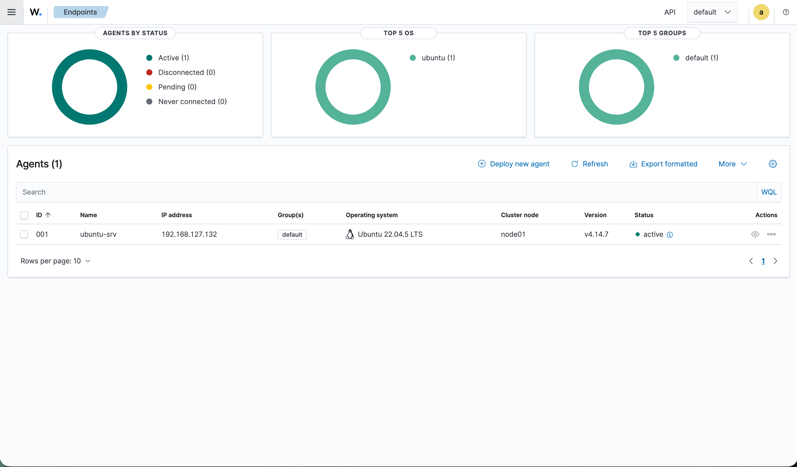
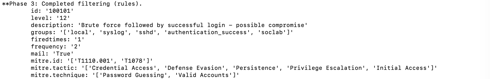
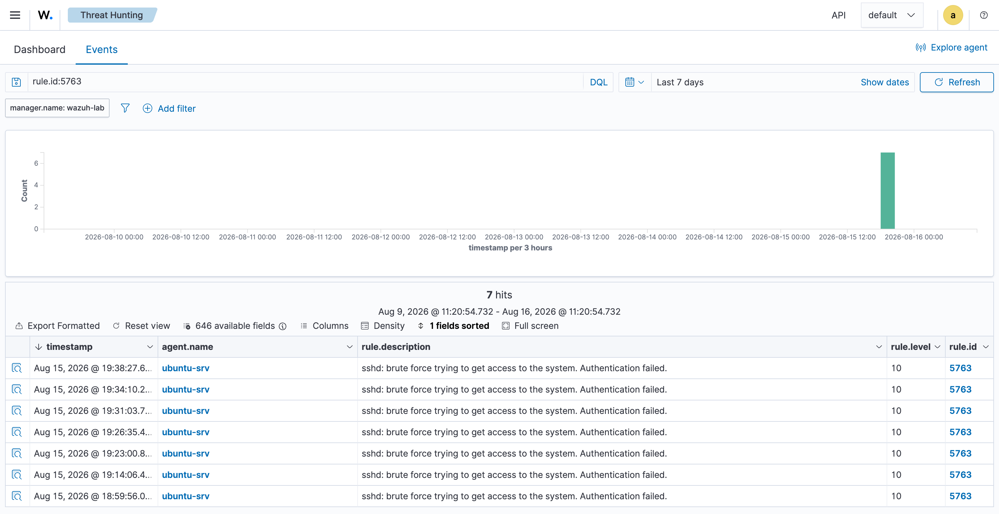
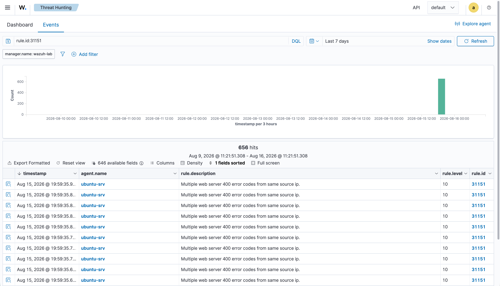

# SOC Detection Lab — Wazuh SIEM, Custom Detections & Essential Eight
 
> A self-built blue-team lab: deploy a SIEM, run real attacks against a monitored host,
> triage the resulting alerts, write a custom detection rule to close a gap the default
> ruleset missed, and assess the environment against the ACSC Essential Eight.
>
> The focus is **security operations** — watching a live environment, judging real vs.
> false alerts, escalating or closing with justification, and turning findings into
> detection and hardening improvements.
 
**Stack:** Wazuh 4.14 (SIEM) · Ubuntu 22.04 · hydra · gobuster · Nessus · Microsoft Entra ID (identity)
 
---
 
## Environment
 
A deliberately minimal, resource-light lab (built on Apple Silicon / 16 GB):
 
| Host | Role | Detail |
|---|---|---|
| `wazuh-lab` (192.168.127.131) | SIEM + attack host | Wazuh all-in-one; hydra/gobuster run from here |
| `ubuntu-srv` (192.168.127.132) | Monitored target | Wazuh agent 001, sshd, nginx |
 
Attacks originate from the SIEM host against the monitored target; detection is via the
agent on `ubuntu-srv`. **Scope note:** this trimmed lab is Linux-only. Windows/AD/Sysmon
detections are intentionally out of scope due to Apple-Silicon virtualisation constraints
(no ARM64 Windows Server eval image) — a deliberate, documented decision rather than an
omission. Cloud identity is handled separately in Microsoft Entra ID (MFA enforced via
Security Defaults).
 

 
---
 
## What this lab demonstrates
 
Three attack scenarios, each producing a triage note with a different verdict — because
real L1 work is not "everything is an attack"; the skill is telling them apart and
justifying the call.
 
| # | Scenario | Detection | Verdict | Action | Triage |
|---|---|---|---|---|---|
| 01 | SSH brute force (hydra) | rule 5763 (lvl 10) | **True positive — compromised** | Escalate | [alert-001](triage/alert-001-ssh-bruteforce.md) |
| 02 | Web directory enumeration (gobuster) | rule 31151 (lvl 10) | **True positive — recon** | Monitor only | [alert-002](triage/alert-002-web-enumeration.md) |
| 03 | High-frequency logins (automation) | rule 5715 (lvl 3) | **False positive** | Close | [alert-003](triage/alert-003-benign-automation.md) |
 
Three true/false verdicts, one escalation, one monitor-only, one close — a realistic
distribution across the full L1 judgement spectrum.
 
---
 
## The core finding — a detection gap, and the rule that closes it
 
The SSH brute force **succeeded** (weak-password account `awong` was compromised —
confirmed in `auth.log`), yet the shipped ruleset raised the *attempts* loudly (four
level-10 rules) while the *successful login* that followed produced only a level-3
event and **no high-severity alert**. The moment of compromise was near-invisible in
the SIEM.
 
I wrote a custom correlation rule to close this — [`detections/local_rules.xml`](detections/local_rules.xml):
 
```xml
<rule id="100101" level="12" timeframe="120">
  <if_sid>5715</if_sid>              <!-- successful login -->
  <if_matched_sid>5763</if_matched_sid>  <!-- preceded by brute force -->
  <same_srcip />                     <!-- from the same source -->
  <description>Brute force followed by successful login - possible compromise</description>
  <mitre><id>T1110.001</id><id>T1078</id></mitre>
</rule>
```
 
Validated with `wazuh-logtest` (stateful replay against the real analysisd engine):
the chain `5760 ×7 → 5763 (brute force) → 100101 (level 12)` fires as designed.
 

 
---
 
## Two detection-engineering lessons (found in the lab, not a textbook)
 
**1. Detection coverage ≠ detection reliability.** The SSH *success* events (5715)
traversed journald and were delivered to the pipeline inconsistently (1 of 12 in live
replay), while the web scan's nginx `access.log` (a flat file read directly) was
lossless. Same SIEM, same agent — the **log source** decided reliability. Rule 100101
is proven correct via logtest; its live firing depends on that telemetry landing.
 
**2. Custom rules have their own false-positive surface.** Rule 100101 correlates on
`same_srcip` but **not on user** — so a brute force against one account followed within
120s by a legitimate login as a *different* account from the same IP would misfire. The
fix (add `same_user`) is documented in [alert-003](triage/alert-003-benign-automation.md).
Writing a rule, testing it against varied scenarios, finding its blind spot, and
proposing the fix is the full detection-engineering loop.
 
---
 
## Essential Eight assessment
 
The lab environment is assessed against the ACSC Essential Eight Maturity Model —
[`reports/essential-eight-assessment.md`](reports/essential-eight-assessment.md).
The assessment states applicability per control (scoring Windows-specific mitigations as
N/A rather than inflating a number), rates each applicable mitigation against real
evidence, and ties the highest-priority gaps back to the detection findings: the
weaknesses that let Alert #001's compromise succeed (weak-password account, password
SSH auth, passwordless sudo, patch lag) are exactly the top E8 remediation items.
 
**Detection proves the attack; the E8 assessment explains the configuration weaknesses
that let it succeed.**
 
---
 
## Detection evidence
 

 

 
---
 
## Repository structure
 
```
soc-detection-lab/
├── README.md
├── triage/
│   ├── alert-001-ssh-bruteforce.md     true positive → escalate
│   ├── alert-002-web-enumeration.md    true positive (recon) → monitor
│   └── alert-003-benign-automation.md  false positive → close
├── detections/
│   └── local_rules.xml                 custom rule 100101 (+ logtest notes)
├── reports/
│   └── essential-eight-assessment.md   E8 maturity assessment
└── screenshots/
    ├── wazuh-agents.png
    ├── ssh-alert.png
    ├── webscan-alert.png
    └── logtest-100101.png
```
 
---
 
## Ethics
 
All attacks were performed against my own lab hosts on an isolated network. No
production systems were involved. Weak credentials used for demonstration are not
reproduced here.
 
---
 
*Personal skills-development lab. Canberra, 2026.*
